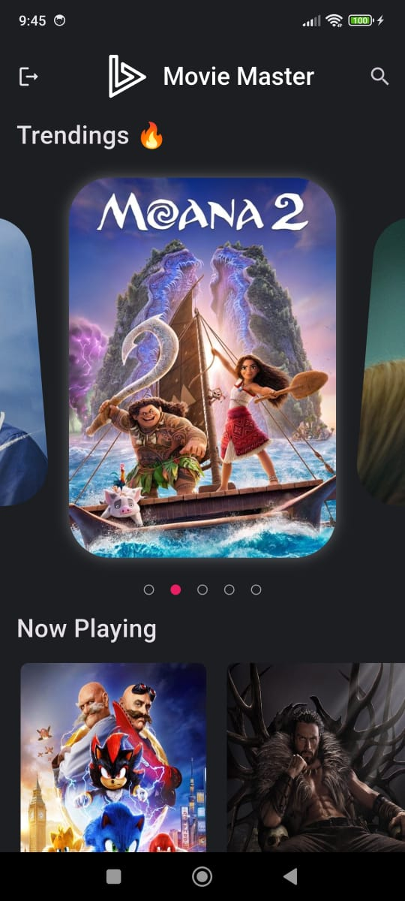
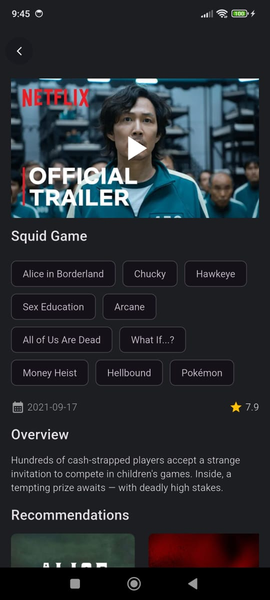
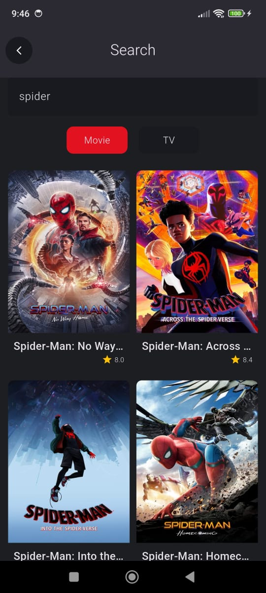
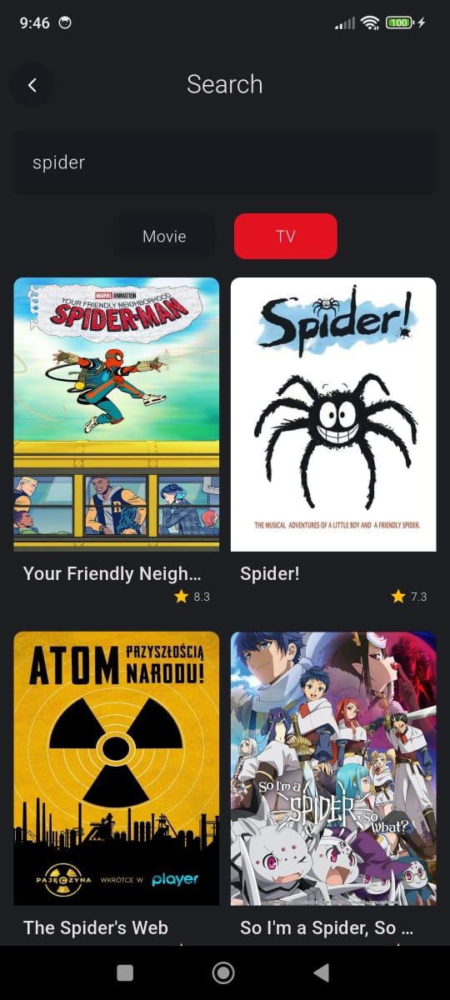

# 🔥🔥 Movie Master

Movie Master is a fully functional movie search app with video player of movie or tv show trailer.

## ✨ Requirements

* Any Operating System (ie. MacOS X, Linux, Windows)
* Any IDE with Flutter SDK installed (ie. IntelliJ, Android Studio, VSCode etc)
* A little knowledge of Dart and Flutter

## Features

* Signin/up
* Carousel image on trending movies
* List of now playing movies
* Recommendation of tv shows
* Search movies / tv shows
* Used Cubit to manage state

## Screenshots

<p>
 
 
 
 
</p>

## Instalation

#### 1. [Setup Flutter](https://flutter.dev/docs/get-started/install)

#### 2. Clone the repo

#### 3. Get dependencies
``` 
flutter pub get || flutter packages get 
```

#### 4. Run the app
``` 
flutter run 
```

# Note
* The API I use on this app is provided by [madinazmi](https://github.com/mahdinazmi). This project is also a tutorial from him on his youtube channel [Flutter Guys](https://www.youtube.com/@flutterguys)